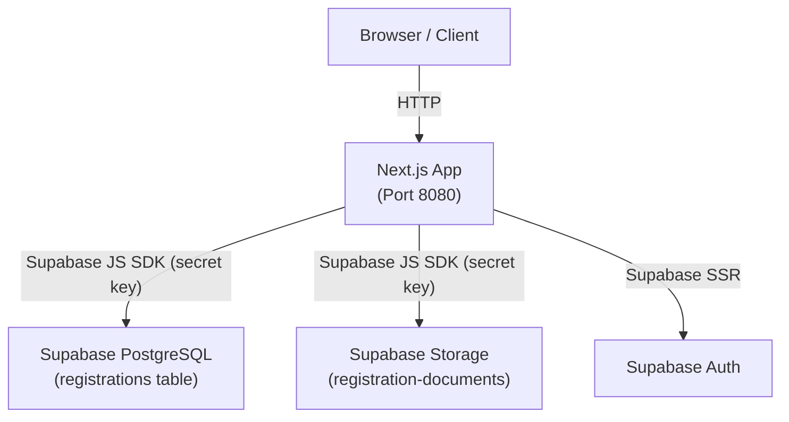
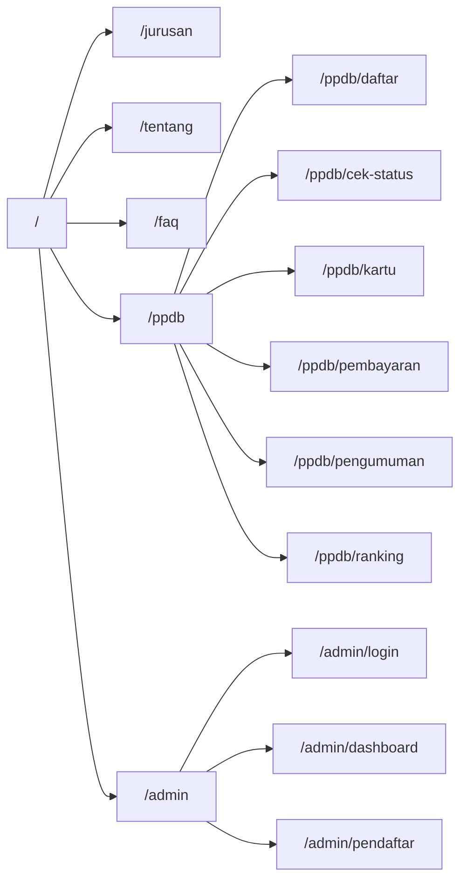
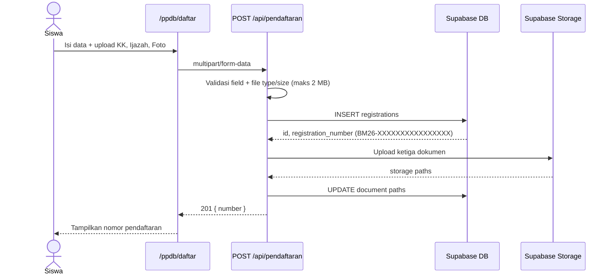
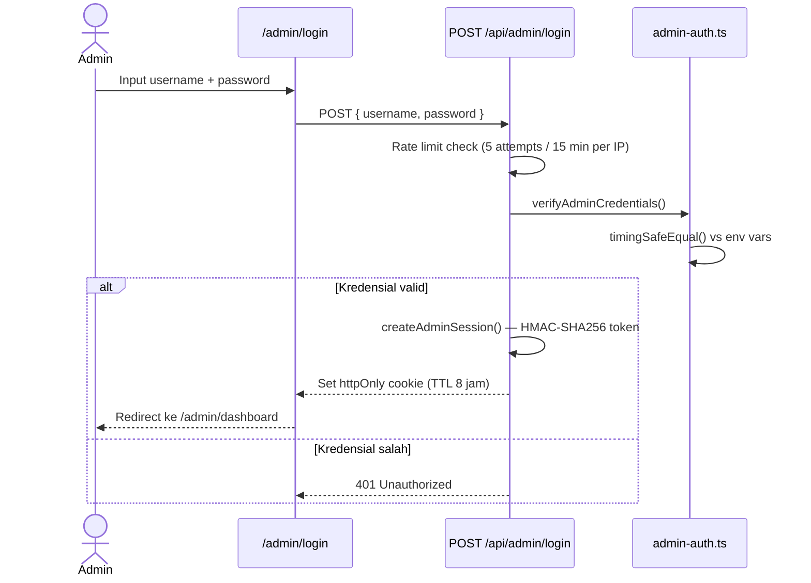
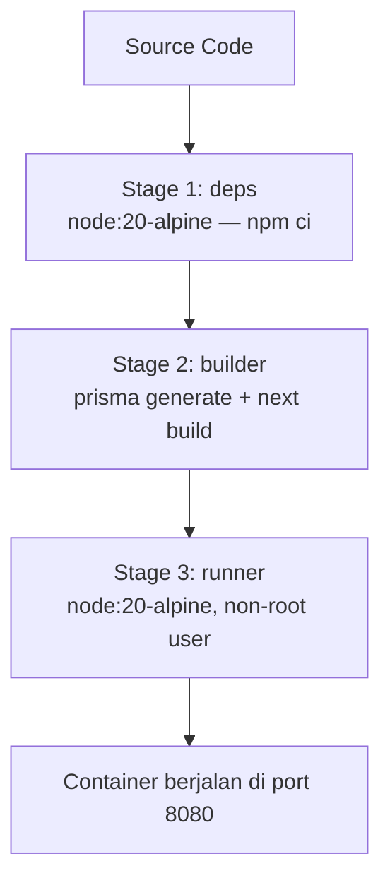

# PPDB SMK Bani Masum

Sistem informasi penerimaan peserta didik baru untuk SMK Bani Masum. Aplikasi ini menangani seluruh alur pendaftaran secara online — mulai dari pengisian formulir, upload dokumen, hingga pengecekan status — serta dilengkapi panel admin untuk mengelola data pendaftar.

---

## Stack

Dibangun di atas **Next.js 16** dengan App Router dan dikompilasi ke mode `standalone` agar mudah di-deploy menggunakan Docker. Bahasa yang digunakan TypeScript di seluruh codebase.

Untuk styling menggunakan **Tailwind CSS 4** dengan animasi dari **Framer Motion**. Database-nya PostgreSQL yang dikelola lewat **Supabase**, dengan **Prisma 7** sebagai ORM menggunakan driver adapter. Upload dokumen disimpan di **Supabase Storage**. Sesi admin tidak menggunakan library third-party — diimplementasikan sendiri menggunakan HMAC-SHA256.

---

## Struktur Aplikasi

```
ppdb_smk_bani_masum/
├── app/
│   ├── admin/              # Halaman admin (dashboard, login, pendaftar)
│   ├── api/
│   │   ├── admin/
│   │   │   ├── login/      # POST login, DELETE logout
│   │   │   └── pendaftar/  # GET list pendaftar (admin only)
│   │   └── pendaftaran/    # GET cek status, POST daftar baru
│   ├── components/         # Shared UI components
│   ├── lib/
│   │   ├── admin-auth.ts   # HMAC session + credential verification
│   │   └── ppdb-data.ts    # Data statis: jadwal, jurusan, galeri
│   ├── ppdb/               # Alur PPDB publik
│   └── layout.tsx
├── prisma/
│   └── schema.prisma
├── public/
├── Dockerfile
├── docker-compose.yml
└── .dockerignore
```

---

## Arsitektur

### Gambaran Sistem



### Rute Aplikasi



### Alur Pendaftaran



### Alur Login Admin



### Docker Build



---

## Setup Development

Pastikan sudah punya Node.js 20+ dan npm 10+.

```bash
# Clone dan install
npm install

# Generate Prisma client
npm run db:generate

# Jalankan dev server
npm run dev
```

Buka `http://localhost:8080`.

Sebelum menjalankan, buat file `.env.local` di root project:

```env
NEXT_PUBLIC_SUPABASE_URL=https://<project-ref>.supabase.co
NEXT_PUBLIC_SUPABASE_PUBLISHABLE_KEY=sb_publishable_...

SUPABASE_URL=https://<project-ref>.supabase.co
SUPABASE_SECRET_KEY=sb_secret_...

ADMIN_USERNAME=<username>
ADMIN_PASSWORD=<password>
ADMIN_SESSION_SECRET=<random 64-char hex>

DATABASE_URL=postgresql://<user>:<pass>@<host>:6543/<db>?pgbouncer=true
DIRECT_URL=postgresql://<user>:<pass>@<host>:5432/<db>
```

Generate `ADMIN_SESSION_SECRET` dengan:

```bash
node -e "console.log(require('crypto').randomBytes(32).toString('hex'))"
```

---

## Database

Jalankan migrasi sebelum pertama kali menggunakan aplikasi:

```bash
# Development — buat dan apply migrasi baru
npm run db:migrate

# Production — apply migrasi yang sudah ada
npm run db:deploy
```

Dokumen yang diupload pendaftar disimpan di bucket Supabase Storage bernama `registration-documents`. Buat bucket ini secara manual di dashboard Supabase dengan akses **private**. Struktur path-nya:

```
registration-documents/
└── BM26-<16-hex>/
    ├── kk-<uuid>
    ├── ijazah-<uuid>
    └── photo-<uuid>
```

---

## API

### Pendaftaran

**`POST /api/pendaftaran`** — Submit formulir pendaftaran. Menerima `multipart/form-data` dengan field teks (nama, NISN, tanggal lahir, telepon, nama orang tua, telepon orang tua, jurusan) dan tiga file dokumen (KK, ijazah, foto). Setiap file harus berformat PDF, JPG, atau PNG dengan ukuran maksimal 2 MB. Tidak memerlukan autentikasi.

Jika berhasil, API merespons `201` dengan nomor pendaftaran:
```json
{ "number": "BM26-XXXXXXXXXXXXXXXX" }
```

**`GET /api/pendaftaran?number=BM26-...`** — Cek status pendaftaran. Nomor harus sesuai pola `BM26-[A-F0-9]{16}`.

```json
{
  "registration": {
    "number": "BM26-XXXXXXXXXXXXXXXX",
    "name": "Nama Siswa",
    "status": "pending"
  }
}
```

### Admin

**`POST /api/admin/login`** — Login dengan `{ username, password }`. Rate limited 5 percobaan per IP per 15 menit. Jika berhasil, set cookie sesi httpOnly dengan TTL 8 jam.

**`DELETE /api/admin/login`** — Logout, menghapus cookie sesi.

**`GET /api/admin/pendaftar`** — Ambil seluruh data pendaftar. Memerlukan cookie sesi admin yang valid.

---

## Deploy dengan Docker

```bash
# Build dan jalankan
docker compose up --build -d

# Cek status
docker compose ps

# Lihat log
docker compose logs -f

# Hentikan
docker compose down
```

Aplikasi berjalan di `http://localhost:8080`.

### Deploy ke VPS

Upload project ke server, lalu pastikan `.env.local` tersedia di sana:

```bash
rsync -avz --exclude=node_modules --exclude=.next --exclude=.git \
  . user@server:/srv/ppdb

scp .env.local user@server:/srv/ppdb/.env.local
```

Kemudian di server:

```bash
cd /srv/ppdb
docker compose up --build -d
```

Arahkan traffic HTTPS dari Nginx atau Caddy ke port 8080. Contoh konfigurasi Nginx:

```nginx
server {
    listen 443 ssl;
    server_name ppdb.smkbanimasum.sch.id;

    ssl_certificate     /etc/letsencrypt/live/ppdb.smkbanimasum.sch.id/fullchain.pem;
    ssl_certificate_key /etc/letsencrypt/live/ppdb.smkbanimasum.sch.id/privkey.pem;

    location / {
        proxy_pass         http://127.0.0.1:8080;
        proxy_http_version 1.1;
        proxy_set_header   Host              $host;
        proxy_set_header   X-Real-IP         $remote_addr;
        proxy_set_header   X-Forwarded-For   $proxy_add_x_forwarded_for;
        proxy_set_header   X-Forwarded-Proto $scheme;
    }
}
```

---

## Catatan Keamanan

Beberapa hal yang perlu diperhatikan saat deploy:

- Kredensial admin **tidak disimpan di database** — hanya dibaca dari environment variable saat runtime.
- Perbandingan username dan password menggunakan `timingSafeEqual` untuk menghindari timing attack.
- Token sesi ditandatangani dengan HMAC-SHA256 menggunakan `ADMIN_SESSION_SECRET`. Jangan sampai secret ini bocor.
- Cookie sesi bersifat `httpOnly`, `secure`, dan `sameSite=strict` — tidak bisa dibaca JavaScript dan hanya dikirim lewat HTTPS.
- Supabase Storage hanya diakses dari server menggunakan service role key, tidak pernah diekspos ke client.
- Container berjalan sebagai user non-root (`nextjs:nodejs`).
- File `.env.local` tidak boleh di-commit ke repository.

---

## Program Keahlian

**RPL — Teknik Komputer dan Jaringan**
Fokus pada pengembangan aplikasi, website, dan solusi digital untuk industri.

**TBSM — Teknik dan Bisnis Sepeda Motor**
Mencakup perawatan mesin, kelistrikan, dan diagnosis kendaraan modern.
